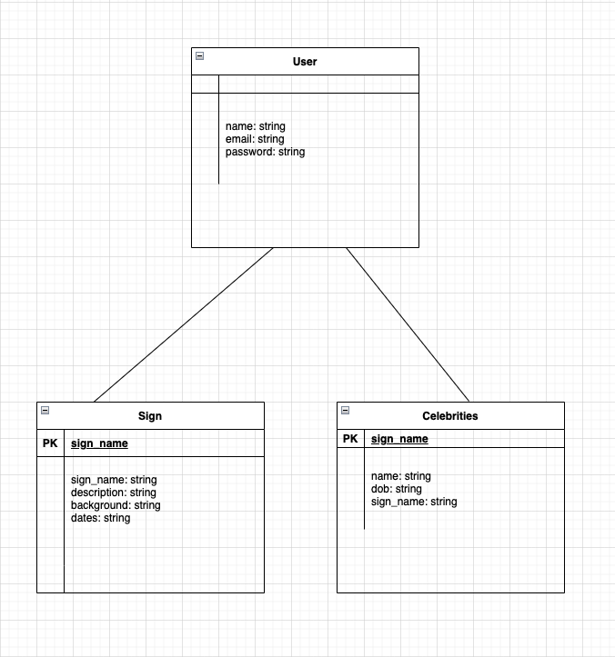

# Zodia
A social hub for all things Zodiac!  See here --> https://zodia-app.herokuapp.com/

## Purpose of this application
To provide a social hub about Zodiac information.  This app allows you to create/read/update/delete thie hub of zodiac information.

## How does it work?
Zodia is a Node.js Express application that uses Sequelize to connect to a Postgres SQL database.  The following dependencies were used:
```
"dependencies": {
    "axios": "^0.21.4",
    "bcryptjs": "^2.4.3",
    "connect-flash": "^0.1.1",
    "dotenv": "^8.2.0",
    "ejs": "^3.1.5",
    "express": "^4.17.1",
    "express-ejs-layouts": "^2.5.0",
    "express-session": "^1.17.2",
    "faker": "^5.5.3",
    "method-override": "^3.0.0",
    "morgan": "^1.10.0",
    "node-fetch": "^2.6.2",
    "passport": "^0.4.1",
    "passport-local": "^1.0.0",
    "pg": "^8.5.1",
    "sequelize": "^6.3.5",
    "sequelize-cli": "^6.3.0",
    "unsplash-js": "^7.0.15"
  }, 
  ```

## Screenshots
### Front Page


### Log In


### Celebrities


## ERD & WIREFRAME



## USER STORIES
### As a user
- Who: Those that want a social hub for Zodiac information.
- What: Being able to see information relevant to Zodiac signs.
- Why: Because they're interested.

## Code Snippets